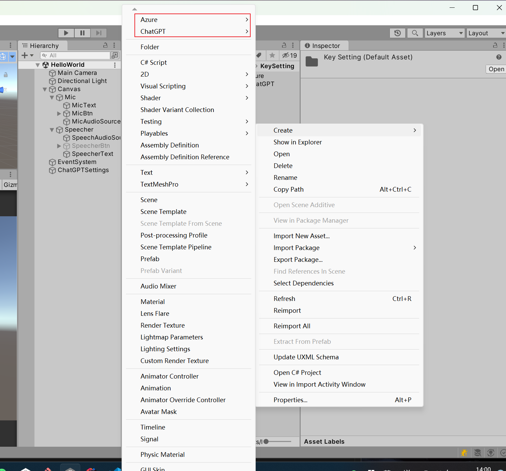
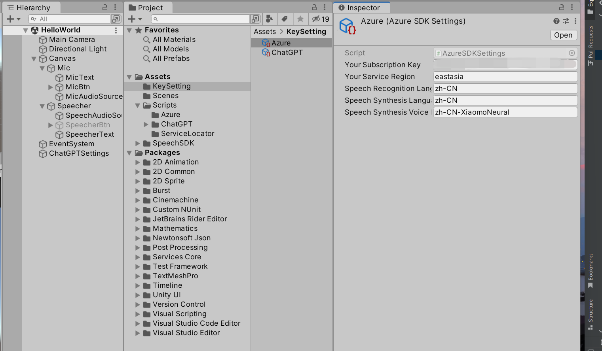
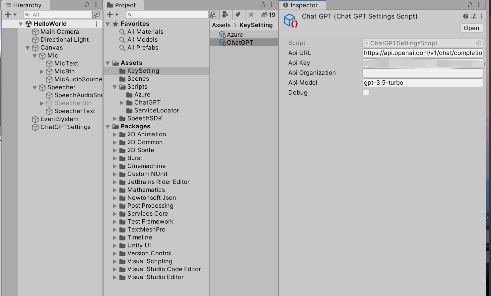

# Azure-Samples

## 官方地址azure sdk demo地址:

本代码基于官方的sdk的demo修改过来的

[cognitive-services-speech-sdk/samples/csharp/unity/from-unitymicrophone at master · Azure-Samples/cognitive-services-speech-sdk · GitHub](https://github.com/Azure-Samples/cognitive-services-speech-sdk/tree/master/samples/csharp/unity/from-unitymicrophone)

## 修改接入azure sdk

sdk怎么获取订阅和使用的github地址:

[GitHub - Azure-Samples/cognitive-services-speech-sdk: Sample code for the Microsoft Cognitive Services Speech SDK](https://github.com/Azure-Samples/cognitive-services-speech-sdk)

### 工程怎么调试和使用和接入chatgpt

## 新建azure和chatgpt的配置

> 由于key这个是保密性的东西，本demo没有架在服务器上面，仅仅是作为测试使用，直接放到客户端的，不安全，所以没又上传到工程，需要右键自己添加相关配置文件。这个两个配置文件是通过ScriptableObject写的

1. 右键Create->Azure下去创建一个azure sdk的配置文件，具体怎么上去获取key和区域信息请看官方文档，不要填错了，填错了就发不了语音了。
   
   

2. 右键Create->ChatGPT去创建一个chatgpt的一个配置，具体怎么拿到chatgpt的api去自行查找，设置到工程配置文件中去。

3. 运行长按按钮，松开后发送到chatgpt，其它界面等相关都没加，其它逻辑也没加，只是演示，麦克风通过azure sdk识别成文字-发给ChatGPT-ChatGPT返回结果-azuresdk读出来的流程

4. 主要这两个都是要付费的，azure有免费的额度，chatgpt 的api是需要付费的，而且chatapi账号在国内使用容易被封掉，注意使用。
